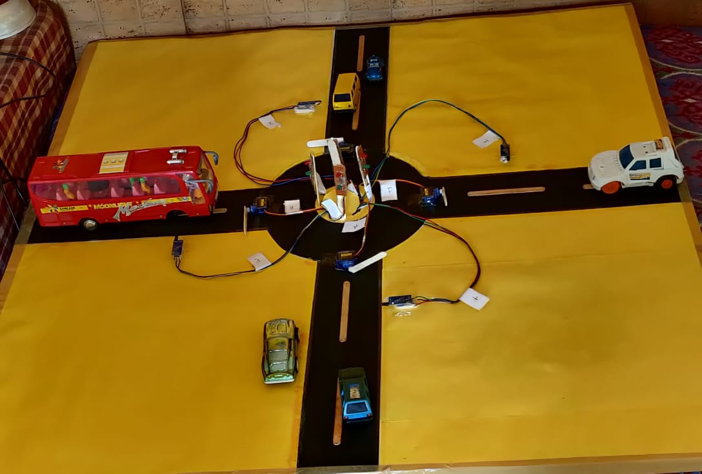

# 🌟 **Intelligent Traffic Control System** 🚦

## 🚗 **Project Overview**

The **Intelligent Traffic Control System** is designed to:
- 🚥 **Automatically manage traffic flow** using sensors to detect vehicles.
- ⚙️ **Control barriers** with servo motors based on obstacle detection.
- 📡 **Use wireless communication** (RF) for remote control.
- 🚦 **Switch traffic lights** between red and green to manage vehicle flow efficiently.

This project enhances real-time traffic management and reduces the need for manual operation at intersections and checkpoints.

---

## 🛠️ **Hardware Components**:
| **Component**         | **Description**                                              |
|-----------------------|--------------------------------------------------------------|
| 🖥️ **Arduino Uno**    | Microcontroller board to control the system.                 |
| 🦾 **Servo Motors (x4)** | To open and close barriers for each lane.                  |
| 🚨 **IR/Ultrasonic Sensors** | Detect obstacles/vehicles in each lane.                |
| 🌐 **VirtualWire Module** | For RF communication.                                     |
| 💡 **LEDs**           | Simulate traffic lights (red/green).                         |

---

## 💻 **Libraries Used**
- **ServoTimer2**: Controls the servos.
- **VirtualWire**: For RF wireless communication.

Install these libraries before uploading the code to your Arduino board.

---

## 🔄 **System Workflow**

1. **Obstacle Detection**: Sensors detect vehicles in each lane.
2. **Barrier Control**: Servos operate based on obstacle data.
3. **Traffic Light Management**: LEDs simulate traffic lights.
4. **Wireless Control**: RF communication manages remote inputs.

> **Tip:** The system is fully automated, but it also accepts remote inputs to control barriers and lights if necessary.

---

## ⚙️ **Code Breakdown**

- **Servo Attachment**: The servos controlling the barriers are attached to specific pins on the Arduino.
- **Obstacle Detection**: Each lane has a sensor that detects whether a vehicle is present. If an obstacle is detected, the barrier remains closed, and the red light stays on.
- **Traffic Light Control**: Depending on the sensor data, the system switches the lights between red and green to either allow or stop traffic in each lane.
- **Wireless Communication**: RF signals are received, which can remotely trigger lane barriers and traffic lights. The system checks the received message to determine which lane's traffic light and barrier should change.
- **Main Loop**: The system continuously monitors each lane and updates the status of the barriers and traffic lights based on the sensor readings.

---

## 🧰 **How to Set Up**

1. **Hardware**:
   - Connect servos to pins 3, 4, 5, and 6.
   - Connect obstacle sensors to pins 36, 38, 40, and 42.
   - Set up the RF module and connect LEDs to simulate traffic lights.

2. **Software**:
   - Install the `ServoTimer2` and `VirtualWire` libraries.
   - Upload the code to your Arduino Uno.
   - Power up the system and let it automatically manage traffic.

---

## 🔍 **Demonstration**

*This image showcases the physical setup of the Intelligent Traffic Control System. The model includes multiple lanes with toy vehicles, representing a typical four-way intersection. Sensors are positioned on each lane to detect incoming vehicles, and servos control the barriers to manage traffic flow. The system is designed to automate the process of stopping and allowing vehicles to pass based on real-time traffic conditions.* 

---

## 🚀 **Future Improvements**
- 🔗 **Integration with smart traffic systems** like AI-based traffic cameras.
- 🛰️ **Cloud monitoring** for real-time data collection and traffic flow optimization.
- 🕹️ **Mobile app control** for remote traffic management via smartphone.

---

## 📋 **License**
This project is licensed under the **MIT License**. Feel free to use, modify, and distribute.

---

## 🤝 **Contributions**
Feel free to submit issues, pull requests, or suggestions. Let's make this project even better!
